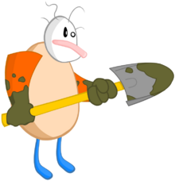

background-image: url(horse1.gif)

class: center, middle

???

How to draw a horse

---

background-image: url(horse2.gif)

class: center, middle

---

background-image: url(horse3.gif)

class: center, middle

---

background-image: url(horse4.gif)

class: center, middle

---

background-image: url(ponies.gif)

class: center, middle

---

class: center, middle

# Dave Cadwallader

## Core Web

---

background-image: url(browsers2.jpg)

class: center, middle

???

At walmart - so many browsers
Back to IE8

---

# Automation Goals

## 1. Dev & QA

???

Non-technical people write tests
Devs run the tests too

--

## 2. Fast

???

Run as part of CI / PR-verify

--

## 3. No flake!

???

Win the hearts and minds

---

background-image: url(nightwatch.jpg)

class: center, middle

---

background-image: url(lion2.jpg)

class: center, middle

---

---

---

---

---

---

---

background-image: url(cupboard.jpg)

class: full-width, left, top

# Unit Tests

---

background-image: url(car.jpg)

class: full-width, left, top, white

# End-To-End Tests (step 1)

---

background-image: url(zombies2.jpg)

class: full-width, left, top

# End-To-End Tests (step 2)

---

background-image: url(market1.jpg)

class: full-width, left, bottom, white

# End-To-End Tests (step 3)

---

background-image: url(market2.jpg)

class: full-width, left, bottom, white

# End-To-End Tests (step 4)

---

background-image: url(brains.png)

class: full-width, left, bottom, white

---

background-image: url(pyramid.png)

class: full-width, center, middle

---

background-image: url(zombie-pyramid.png)

class: full-width, center, middle

---

# Ways that E2E Tests try to eat you

## 1. Buggy webdrivers

--

## 2. Flakey Network

--

## 3. Service bugs/outages

???

"Test flake" holding back real progress
Seemed overwhelming to fix everything - whack-a-mole.
But what if we could magically make the tests "not flakey" anymore?

---

class: middle

**axiom (n)**

*...a premise or starting point of reasoning... a premise so evident as to be accepted as true without controversy.*

???

The mechanism for achieving, not important
Could be swapped out later.

---

background-image: url(gasp.jpg)

class: full-width, center, middle

???

We did a lot of scary stuff to smooth over these bumps
Retry assertions if they fail, retry clicks if they don't work
Retry tests themselves if they fail

Important part: MOMENTUM
Smoothing over better than giving up
Not all problems require precision solutions

---

background-image: url(convoy.jpg)

class: full-width, center, middle

???

Armored convoy to go to grocery store
Is it overkill?  Probably
Is it expensive?  No doubt.
Will fix our reliability problem?  Hell yes!

---

---

10%.....20%.....30%.....40%.....50%.....60%.....70%.....80%.....90%.....100%

--

--

--

--

---

10%.....20%.....30%.....40%.....50%.....60%.....70%.....80%.....90%.....100%

---

10%.....20%.....30%.....40%.....50%.....60%.....70%.....80%.....90%.....100%

???

When we got to this point... proud of accomplishment, but felt kludgy
duct tape, rubber bands.
"not suitable to release"

---

class: middle

.pull-left[]
???
Did we do it with a bunch of clever engineering?  No...
--
.pull-right[]
???
We shoveled shit

---

10%.....20%.....30%.....40%.....50%.....60%.....70%.....80%.....90%.....100%

-----------------------------------------------------------------------------

--

--

--

---

background-image: url(post1.gif)

class: full-width, center, middle

???

---

background-image: url(post2.gif)

class: full-width, center, middle

???

---

shovel shit to get there

---

# \#SSaaS

---

# Credits

* How to draw a horse

  By: Van Oktop
  http://www.vanseodesign.com/blog/wp-content/uploads/2012/08/browser-logos.jpg

* Zombie Image

  By: Pascal
  https://www.flickr.com/photos/pasukaru76/5067879762

* Soup Image

  By: Keoni Cabral
  https://www.flickr.com/photos/keoni101/5200921858

* Cupboard

  By: Getty Images
  http://abcnews.go.com/Health/Wellness/home-remedies-find-kitchen/story?id=24652838

* Convoy

  By: DVIDSHUB
  https://www.flickr.com/photos/dvids/5468695790

momentum is key
smoothing over is better than giving up
certain amount of precision that certain problems don't need
